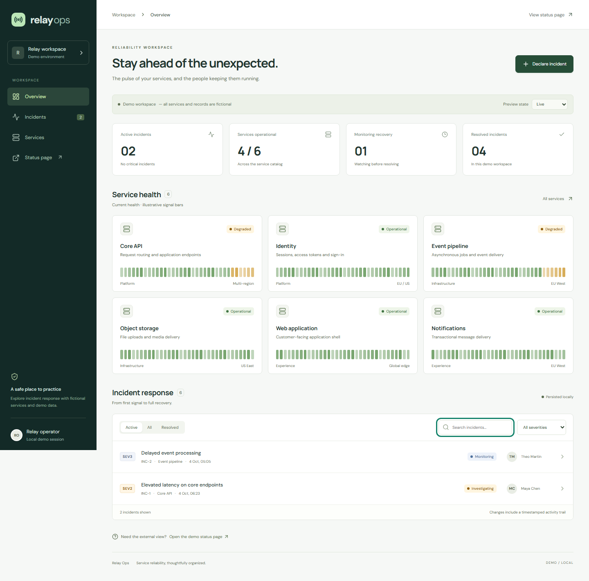

# Relay Ops

A service reliability workspace for coordinating incident response. React, TypeScript, Express and SQLite power six fictional services, a durable incident log, response updates, and a read-only status page.



## Quick start

Requires **Node.js 24+** and npm. No account, API key, external database or paid service is required.

```sh
npm ci
npm run dev
```

Open **http://127.0.0.1:3000**. The demo status page is at **/status**. SQLite is created and seeded on first startup at `data/relay.sqlite`; restarting preserves changes. Fonts are bundled locally.

```sh
npm run build
npm start
```

`PORT` changes the port. `DATABASE_PATH` selects another SQLite file. To start a fresh demo, stop the server and choose a new database path. Back up with SQLite backup tools; do not copy only the main database while WAL writes are active.

## Explore

- **Overview:** derived service health, response counts, incident filters and search.
- **Incidents:** declare an incident, select severity and service, assign a lead, change status and append a required response note. Resolved incidents can be reopened.
- **Services:** related service records with teams and regions. Signal bars are illustrative, not measured telemetry.
- **Status page:** read-only health and incident updates. A local route, not a deployed public site.
- **Preview state:** loading, empty and error presentations without changing stored data.

Try declaring a SEV1 incident for Object storage, assigning Theo Martin, and resolving it with a recovery note. Reload and check the timeline and status page.

## Architecture

```text
React workspace / status view
          │ same-origin JSON
Express API + Zod validation
          │ transaction + version check
SQLite (services → incidents → events)
```

`src/domain.ts` shares schemas, types and the health rule. `server/store.ts` owns persistence; SQL uses bound parameters and foreign keys. Mutations and timeline events commit atomically. Each update supplies the observed version: a stale writer gets HTTP 409. Refresh and reopen the incident before retrying a conflict.

`server/app.ts` maps validation and domain failures to JSON. The Node server runs Vite middleware in development and serves the production bundle after building. The client-rendered application needs no separate API process or CORS configuration.

| Endpoint                   | Purpose                                        |
| -------------------------- | ---------------------------------------------- |
| `GET /api/snapshot`        | Services, incidents and history                |
| `POST /api/incidents`      | Validated incident creation                    |
| `PATCH /api/incidents/:id` | Versioned status/lead update and required note |

## Quality checks

```sh
npm run lint
npm run typecheck
npm test
npm run build
npx playwright install chromium
npm run test:e2e
```

Integration tests use isolated SQLite databases and cover persistence after reopening, atomic timelines, invalid payloads/references, malformed JSON, missing records and competing writers. Browser tests run against the production build, exercise creation through resolution and reload, cover empty/error/loading states, scan accessibility with axe, and inspect desktop, tablet and mobile layouts. E2E uses `data/e2e.sqlite`; screenshots are saved to `docs/screenshots`.

GitHub Actions runs the same checks. Automated accessibility checks complement manual keyboard and screen-reader review.

## Demo boundaries

All services, people and incidents are fictional. Metrics count those records; no real customers, measured uptime or production reliability are claimed. Seed timestamps are relative to first database creation.

This is a **local single-workspace demo**, bound to loopback. There is no authentication, authorization, audit identity, ingestion, alert delivery, rate limiting, pagination or retention job. The status page displays descriptions and updates; do not enter confidential information. Creation has no replay key, so retrying after a lost response may create a duplicate. Refresh retrieves current data; there is no automatic polling. SQLite synchronous access suits this small dataset, not high-volume telemetry.

Before internet deployment, add authenticated operators, a curated public status API, request limits, backups, migrations, observability and hosting-appropriate persistent storage. Public hosting is intentionally not configured.

## References

- [React effects](https://react.dev/reference/react/useEffect)
- [Vite guide](https://vite.dev/guide/)
- [Express API](https://expressjs.com/en/5x/api/)
- [Node SQLite](https://nodejs.org/api/sqlite.html)
- [Playwright web servers](https://playwright.dev/docs/test-webserver)

Portfolio context: [Ilia Yasau](https://github.com/iliayasau).
